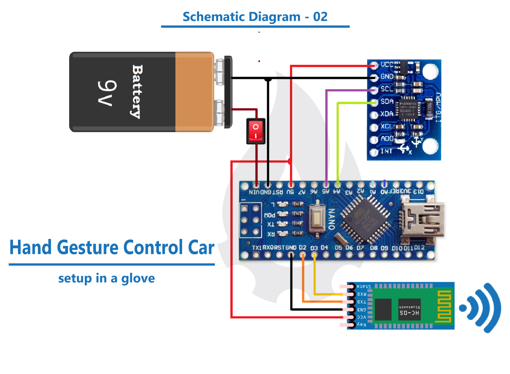
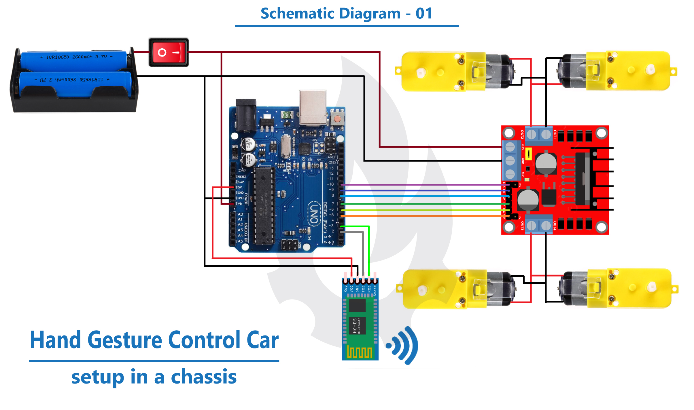

## Hand Gesture Controlled Robots with `Arduino`

|  | 
|:--:|:--:|
| *Hand Side Schematic Diagram* | *Car Side Schematic Diagram* |

---

### :point_right: Necessary Materials:

* Arduino Uno x 1
* Arduino Nano x 1
* HC-05 Bluetooth Module x 2
* MPU-6050 Sensor Module x 1
* L298N DC Motor Driver x 1
* Gear Motor (*Dual Shaft*) x 4
* 9V battery (*Generic*) & Rechargeable (*Li-ion*) Battery
* Robot Car Chassis ~ [here](./LaserCutFiles/)
* Extra (*Breadboard, wires, soldering iron etc.*)

### :point_right: Apps and Platforms:

* [Arduino IDE](https://www.arduino.cc/en/software)

> If you have any problems with this project, feel free to create an issue!
